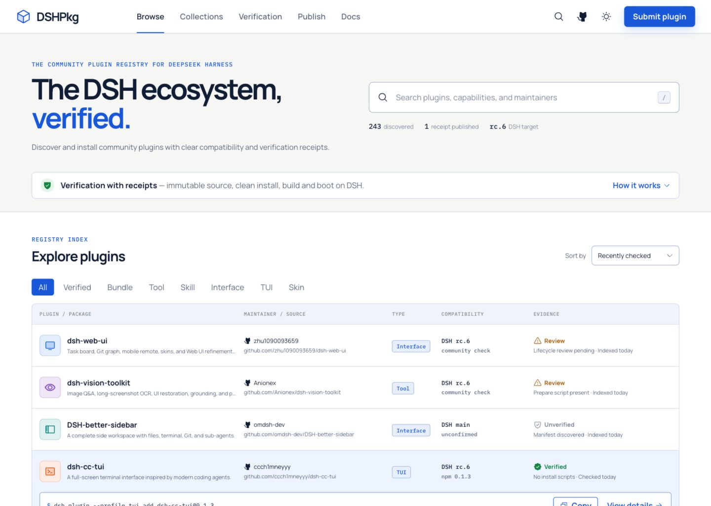

<div align="center">

# DSHPlugin

**一切皆插件。**

由社区共同建设的 DeepSeek Harness 插件发现与验证广场。

[打开 dshplugin.org](https://dshplugin.org) · [参与共建](CONTRIBUTING.md) · [English](README.md)

</div>



> [!NOTE]
> DSHPlugin 是独立的社区项目，不是 DeepSeek 官方产品，也不代表 DeepSeek 的认可或背书。

## 为什么做 DSHPlugin？

DeepSeek Harness 的架构非常开放，但插件发现不应该依赖零散搜索，信任也不应该只看仓库名称。DSHPlugin 希望把插件发现、源码来源、兼容性和验证状态放进一个专注、透明的目录中。

项目选择公开共建，让插件作者、DSH 用户、安全研究者和翻译贡献者都能参与改善生态。

欢迎直接访问正式站点 **[dshplugin.org](https://dshplugin.org)**。

## 已有能力

- 可搜索、可分页的插件目录，直接链接规范化后的源码仓库
- 英语、简体中文、日语、韩语和西班牙语
- 浅色、深色及跟随系统主题
- 跨平台 DSH 安装命令
- 从 [`awesome-dsh-plugins`](https://github.com/AdamPlatin123/awesome-dsh-plugins) 同步社区目录
- 通过 Git smart HTTP 校验仓库，拒绝失效链接和占位仓库
- 基于 Cloudflare D1 的插件提交、举报和审核状态闭环
- 使用 Cloudflare Access 保护的管理后台，并在 Worker 内再次验证 JWT
- 基于证据的认证标识；外部导入条目不会自动获得认证

## 信任模型

“收录”和“认证”是两件不同的事：

| 状态 | 含义 |
| --- | --- |
| 未认证 | 源码仓库可以公开访问，但 DSHPlugin 尚未生成验证证据。 |
| 审核中 | 条目或证据需要人工检查。 |
| 已认证 | 已针对不可变源码 revision 和明确的 DSH revision 记录验证证据。 |

绿色认证标识只说明某个具体版本已有验证记录，不代表对未来版本作永久保证。

## 本地开发

需要 Node.js 20 或更高版本。

```bash
git clone https://github.com/oa1mgo/dshplugin.git
cd dshplugin
npm ci
npm run dev
```

只修改目录 UI 时，Vite 开发服务器就足够了。需要本地运行完整 Worker 与 D1 流程时：

```bash
cp wrangler.example.jsonc wrangler.jsonc
cp .dev.vars.example .dev.vars
npm run build
npx wrangler d1 migrations apply dshplugin-moderation --local
npx wrangler dev
```

常用检查：

```bash
npm test
npm run build
npm run test:sites
npm run verify
npm run check:catalog-links
```

## 隐私与自部署

仓库只包含通用部署示例。真实的 Cloudflare 账号信息、Access 参数、D1 ID、域名路由、管理员邮箱和本地密钥都被 Git 忽略。

自部署时请复制 `wrangler.example.jsonc`，创建自己的 D1 数据库与 Access 应用，并通过 `wrangler secret put` 或 Cloudflare 控制台配置 `ADMIN_EMAIL`、`CF_ACCESS_AUD` 和 `CF_ACCESS_ISSUER`。请同时保护 `/admin*` 和 `/api/admin/*`。

任何 fork 都必须使用自己的 Cloudflare 账号、数据库、Access 策略和身份服务；公开源码不会赋予任何人进入线上 DSHPlugin 后台的权限。

## 一起共建

你可以从这些方向参与：

- 提交新插件或修复错误仓库链接
- 改进认证方法和证据展示
- 增加目录、API、链接与多语言测试
- 改善无障碍、响应式体验和翻译
- 研究插件健康度、兼容性与自动验证

请先阅读 [CONTRIBUTING.md](CONTRIBUTING.md)。中文和英文 Issue/PR 都欢迎。提交信息使用 [Conventional Commits](https://www.conventionalcommits.org/)，例如 `feat: add plugin health filters` 或 `fix: reject unreachable repository redirects`。

安全问题请不要提交公开 Issue；请按照 [SECURITY.md](SECURITY.md) 使用 GitHub 私密漏洞报告。

## 致谢与许可

感谢 [`deepseek-ai/deepseek-harness`](https://github.com/deepseek-ai/deepseek-harness)、[`awesome-dsh-plugins`](https://github.com/AdamPlatin123/awesome-dsh-plugins) 以及每一位插件作者和贡献者。

项目采用 [MIT License](LICENSE)。
